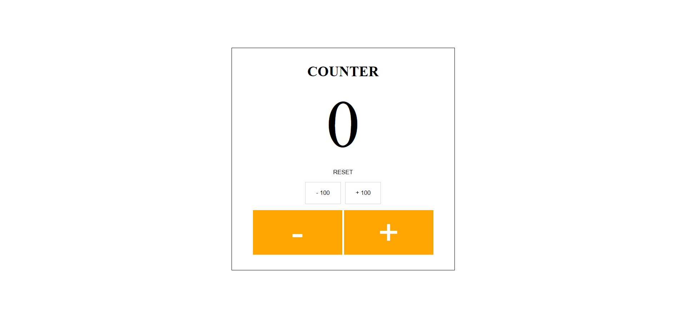

# A simple and responsive Counter App using React.js
## [Live Site](https://bobby-coder.github.io/Counter-App/)

## Introduction

This is a code repository for the Counter app.

## Usage

To run the application locally, clone the repo, install dependencies and run the app.

```
$ git clone https://github.com/Bobby-coder/Counter-App.git
$ cd Counter-App
$ npm start
```

The app starts in development mode and opens a browser window on http://localhost:3000. The project rebuilds and the browser reloads automatically when source files are changed. Any build or runtime errors are propagated and displayed in the browser.

Setup:

- run `npm start` to start the development server
